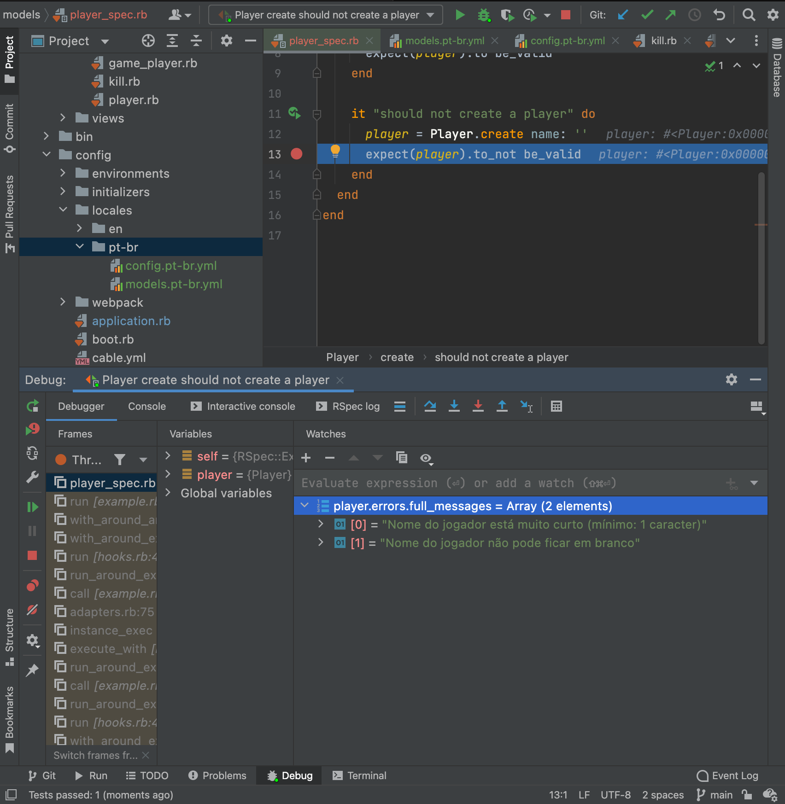
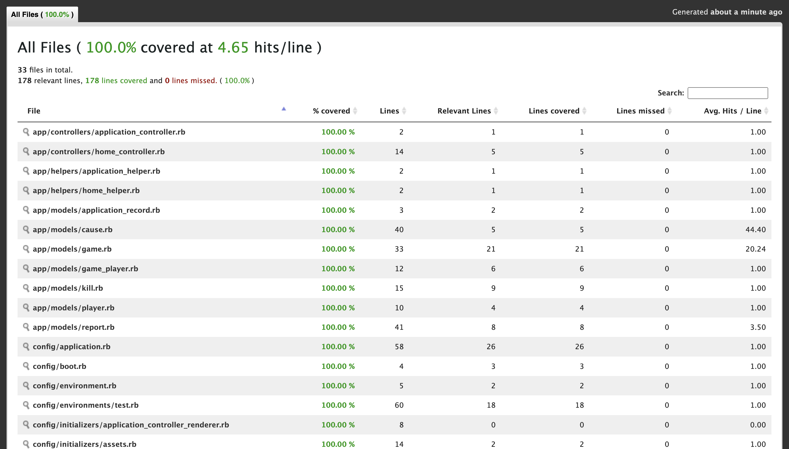

# QakeLogTestCloudWalk

QakeLog CloudWalk Test

1. GitLab repo: https://gitlab.com/TonGarcia/qakelog
2. GitHub repo: https://github.com/TonGarcia/QakeLogTestCloudWalk

## Running it (docker)

Just run: ``` $ docker-compose up -d ```

## Running it (local)

1. Clone it
2. Install RVM
3. Go to the the project via terminal and it gonna install the dependencies
4. Run: ``` $ rails db:create && rails db:recreate ```
   1. To prevent "print spam" set "show_progress" to false at: seeds.rb (SCROLL TO LEFT ON TERMINAL)

## ToDo / Goals

- [x] Read the log file
- [x] Group the game data of each match
- [x] Collect kill data

## Project Ends

1. WebServer (data loader) - Heroku
2. ELK (data visualization) - Docker - Vultr
3. Python (data science) - Google Drive Colab
4. EVM (stablecoin + NFT with the data) - Ethereum &/or Polygon

## Project Stack

* __Render__: Slim
* __File Import__: Lib
* __Database__: Postgresql
* __Server__: Puma
* __CI/CD__: GitlabCI & GitHub Action
* __Static Code Analysis__: Rubocop
* __Test Framework__: RSpec
* __Coverage__: SimpleCov
* __Translation__: I18n
* __FrontEnd__: Reactjs
* __JSON__: jbuilder
* __SoftDelete__: Paranoid
* __Containers__: Dockerfile + Docker-Compose
* __Data__: Elastic Logstash Kibana (ELK)

## Project Archtecture

* __Importer__: Facade + Singleton on Lib to import files
* __Server App__: MVC

# Challenge

## Record example 

```
21:42 Kill: 1022 2 22: <world> killed Isgalamido by MOD_TRIGGER_HURT
```

_The player "Isgalamido" died because he was wounded and fell from a height enough to kill him._

```
2:22 Kill: 3 2 10: Isgalamido killed Dono da Bola by MOD_RAILGUN
```

_The player "Isgalamido" killed the player "Dono da Bola" using the Railgun weapon._

## Example of grouped information for each match

```json
{
  "game_1": {
    "total_kills": 45,
    "players": [
      "Dono da bola",
      "Isgalamido",
      "Zeh"
    ],
    "kills": {
      "Dono da bola": 5,
      "Isgalamido": 18,
      "Zeh": 20
    }
  }
}
```

## Additional notes

1. When `<world>` kill a player, that player loses -1 kill score.
2. Since `<world>` is not a player, it should not appear in the list of players or in the dictionary of kills.
3. The counter `total_kills` includes player and world deaths.

## Report

Create a script that prints a report (grouped information) for each match and a player ranking.

## Plus

Generate a report of deaths grouped by death cause for each match.

Death causes (extracted from [source code](https://github.com/id-Software/Quake-III-Arena/blob/master/code/game/bg_public.h))

```c
// means of death
typedef enum {
  MOD_UNKNOWN,
  MOD_SHOTGUN,
  MOD_GAUNTLET,
  MOD_MACHINEGUN,
  MOD_GRENADE,
  MOD_GRENADE_SPLASH,
  MOD_ROCKET,
  MOD_ROCKET_SPLASH,
  MOD_PLASMA,
  MOD_PLASMA_SPLASH,
  MOD_RAILGUN,
  MOD_LIGHTNING,
  MOD_BFG,
  MOD_BFG_SPLASH,
  MOD_WATER,
  MOD_SLIME,
  MOD_LAVA,
  MOD_CRUSH,
  MOD_TELEFRAG,
  MOD_FALLING,
  MOD_SUICIDE,
  MOD_TARGET_LASER,
  MOD_TRIGGER_HURT,
#ifdef MISSIONPACK
  MOD_NAIL,
  MOD_CHAINGUN,
  MOD_PROXIMITY_MINE,
  MOD_KAMIKAZE,
  MOD_JUICED,
#endif
  MOD_GRAPPLE
} meansOfDeath_t;
```

## Example by death type

```json
{
  "game-1": {
    "kills_by_means": {
      "MOD_SHOTGUN": 10,
      "MOD_RAILGUN": 2,
      "MOD_GAUNTLET": 1,
      ...
    }
  }
}
```

# Proofs

## Locale


## Coverage/Testing
